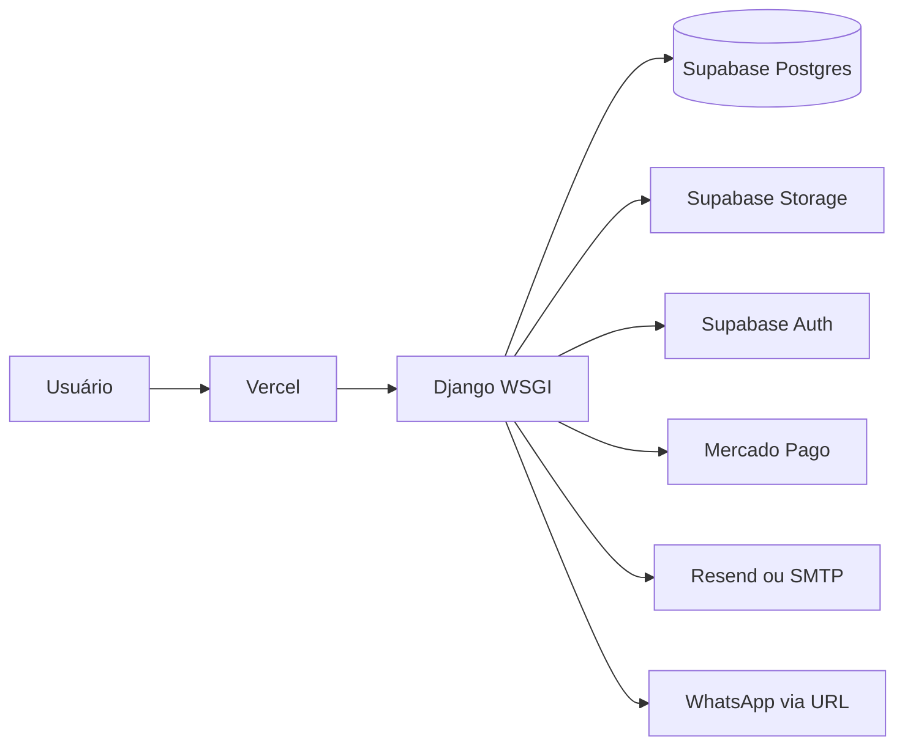

# Arquitetura do sistema

> [!summary] TL;DR
> Monólito Django server-rendered. Views orquestram as requisições HTTP e delegam a
> lógica de negócios para a camada de services. Models guardam regras de domínio
> e templates/CSS/JS entregam a interface. A Vercel executa uma função WSGI.

## Camadas

- `config/`: settings, URLConf e entrada WSGI/ASGI.
- `loja/models.py`: entidades, propriedades de assinatura, estoque e sinais.
- `loja/views.py`: orquestração HTTP (reduzido para 883 linhas).
- `loja/services/`: serviços de domínio (`auth.py`, `billing.py`, `catalog.py`, `products.py`, `store.py`, `lead.py`).
- `loja/forms.py`: validação e escrita dos formulários.
- `loja/templates/`: HTML server-rendered.
- `static/`: CSS global e JavaScript progressivo.
- `loja/*_auth.py`, `storage.py`, `payments.py`, `email_backends.py`:
  adaptadores para serviços externos.

## Persistência e cache

- Produção usa PostgreSQL via transaction pooler do Supabase.
- Desenvolvimento cai para SQLite se nenhuma URL Supabase for fornecida.
- Uploads usam Supabase Storage, S3 compatível ou filesystem, nessa ordem.
- Cache usa Redis se `REDIS_URL` existir; caso contrário, memória do processo.
- Sinais incrementam uma versão de cache por loja quando catálogo muda.

## Implantação

- `vercel.json` encaminha todas as rotas para `api/index.py`.
- A função Python é stateless; banco e mídia locais não são persistência válida.
- Cron diário chama `/api/tasks/cron/` às 02:00 UTC.

## Relacionados

- [[visao-geral]] dá o contexto de produto que esta arquitetura suporta.
- [[endpoints-e-superficies]] detalha as superfícies expostas pelo monólito.
- [[modelo-de-dados]] descreve a persistência usada pelas views e models.
- [[integracoes]] detalha os serviços externos do diagrama.
- [[ADR-001 - Django monolitico na Vercel]] registra a decisão de manter Django server-rendered.
- [[ADR-002 - Supabase como backend principal]] explica a escolha de persistência externa.
- [[gotchas-de-producao]] registra riscos práticos do runtime serverless.
