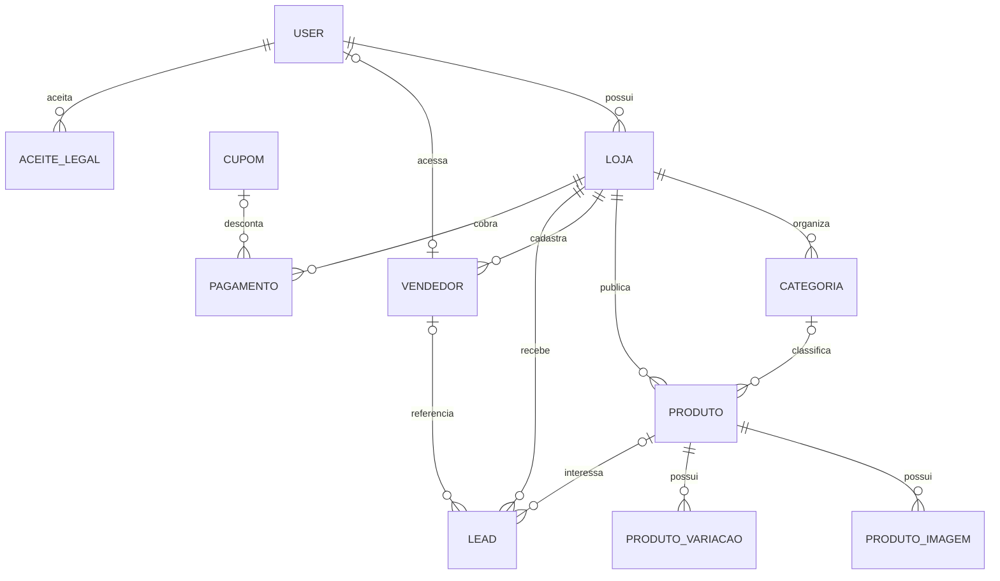

# Modelo de dados

> [!summary] TL;DR
> `Loja` é a raiz do tenant. Produtos, categorias, vendedores, leads e pagamentos
> pertencem a ela. `AceiteLegal` guarda aceite versionado de termos/privacidade.

## Entidades

### Loja

Tenant, marca e assinatura. Campos centrais: usuário, nome, slug único,
WhatsApp, domínio, tema, mídias, plano e datas/status da assinatura.

### Categoria e Produto

Categoria é única por nome dentro da loja. Produto guarda preço, imagem,
listas textuais de tamanhos/cores, flags de publicação e contagem de cliques.

### ProdutoImagem e ProdutoVariacao

Galeria adicional e estoque estruturado por cor/tamanho. Variação é única pela
combinação produto, cor e tamanho.

### Vendedor

Código único dentro da loja, telefone, status e usuário Django opcional.

### Lead

Intenção de compra. Guarda origem, vendedor, produto, variação escolhida,
cliente, entrega/endereço, mensagem, status, IP, navegador e `anonimizado_em`.
O método `anonimizar()` remove dados pessoais e mantém o registro operacional.

### AceiteLegal

Registro versionado de aceite dos Termos de Uso e Política de Privacidade.
Guarda usuário, versões aceitas, fonte do aceite, IP, navegador e data.

### Cupom e Pagamento

Cupom aplica percentual. Pagamento guarda referência externa, IDs do gateway,
valores e resposta bruta. Aprovação ativa a assinatura da loja.

## Regras de exclusão

- Loja: cascata para categorias, produtos, vendedores, leads e pagamentos.
- Categoria em produto: `SET_NULL`.
- Produto em lead: `SET_NULL`.
- Vendedor em lead: `SET_NULL`.
- Usuário em pagamento/vendedor: `SET_NULL`; usuário em loja: cascata.
- Usuário em `AceiteLegal`: cascata.
